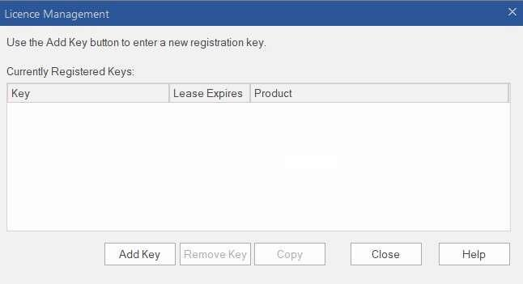
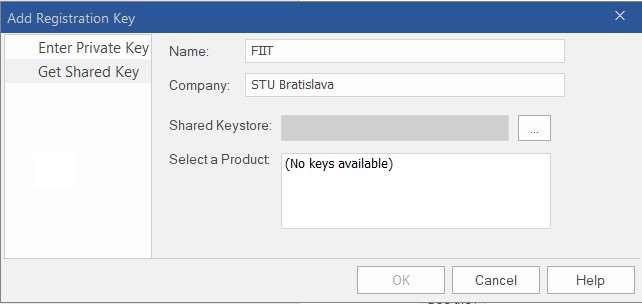
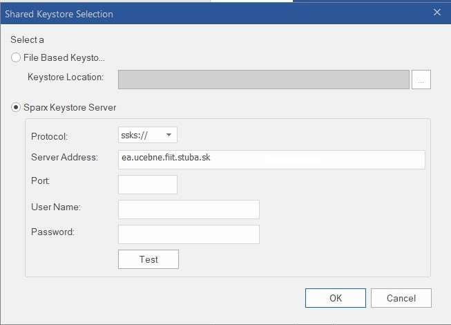
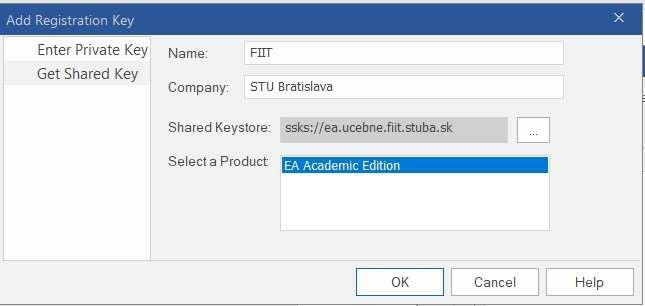
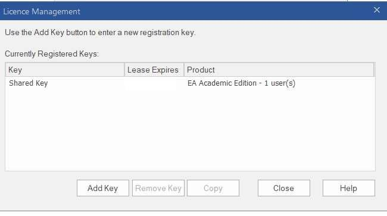
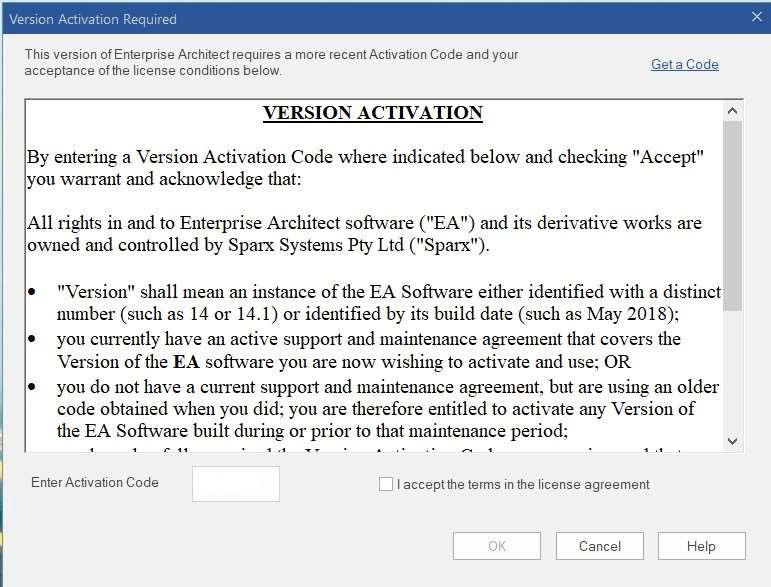

# Enterprise Architect licence on your own laptop

> **KNIFE** – Knowledge In Friendly Examples
> **Series:** Systemic Thinking in IT & Digital Fabrication
> **Level:** Beginner
> **Tags:** `enterprise-architect` `licence` `tutorial` `onboarding` `beginner`

:::caution In Progress
This article is being actively worked on. Content may be incomplete or subject to change.
:::

## ⚡ Quick guide (Top)

1. **Timing:** the licence can only be installed during the **first three weeks of the semester**.
2. **Network:** be on **Eduroam**, otherwise connect via the STU VPN — the licence server sits in the classroom computer network.
3. **Install** Enterprise Architect (installation files are on the document server in AIS) and start it.
4. In the licence window click **Add Key** → tab **Get Shared Key** → Name `FIIT`, Company `STU Bratislava` → **Browse**.
5. Server address: `ea.ucebne.fiit.stuba.sk` → **OK**.
6. Select the product **EA Academic Edition** → **OK**.
7. Enter the **activation code** and accept the licence agreement.

## 🎯 What it solves (purpose, goal)

Enterprise Architect is licensed through a shared licence server in the
classroom network, so it does not work on your own laptop out of the box.
This guide walks through the one-time registration so that EA runs on
your own machine, not only on the classroom computers.

## 🧪 How to use it (application)

### Prerequisites

- The **first three weeks of the semester** — the licence can only be installed in this period.
- The Enterprise Architect installation files, located on the document server in AIS.
- A connection to the licence server, which is located in the classroom computer network. It can be reached from the **Eduroam** network; otherwise log in via **VPN** to the STU network (the guide also applies to Windows 10): https://www.stuba.sk/navody/vpn/w7_vpn.html

### Steps

**1. Add a key.** After installing Enterprise Architect and clicking the icon on the Desktop, a window for adding a licence appears when the software starts. Click **Add Key**.

**2. Fill in the shared key details.** In the next window, on the **Get Shared Key** tab, fill in **Name** (`FIIT`) and **Company** (`STU Bratislava`). Click the **Browse** button.

**3. Enter the licence server.** In the window that opens, enter the FQDN of the license server (`ea.ucebne.fiit.stuba.sk`) and click **OK**.

**4. Select the product.** In the next window, select the product **EA Academic Edition** and click **OK**.

**5. Check the licence period.** In the window that opens, the system displays the period for which the Enterprise Architect product has an available license. After it expires, the license must be renewed.

**6. Activate.** In the last window, you need to enter the activation code and confirm your acceptance of the license agreement.

## 💡 Tips and notes

- **Can't reach the server?** The licence server is only reachable from the classroom network — check that you are on Eduroam or connected to the STU VPN.
- **Licence expired?** The licence has a limited period (step 5) and must be renewed after it expires.
- **Missed the first three weeks?** The licence can no longer be installed on your own laptop after that period.

## ✅ Value / Summary

One written-down procedure with a screenshot for every step, instead of
repeatedly explaining the same click-path to each student — and a clear
statement of the two things that most often go wrong: the time window
(first three weeks) and network access (Eduroam or VPN).

## Sources

Instructions for obtaining a licence for Enterprise Architect on your
own laptops (FIIT STU). A school-specific KNIFE kept in the class
repository, deliberately not in the canonical KNIFE repository.
